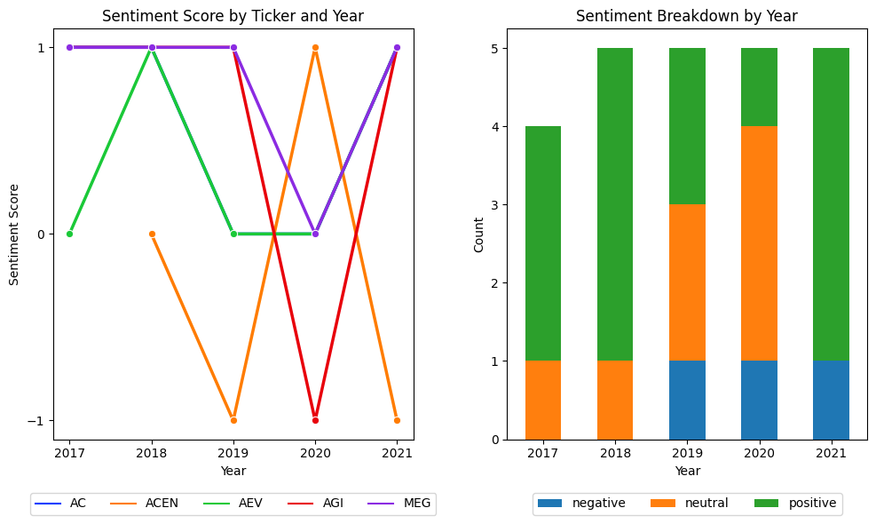

# **MSFIN299-Research**
---

<h1> 
 An Inquiry to using Sentiment Analysis on the Management Discussion and Analysis (MD&A) section of the submitted Form 17-A of Selected Member Companies of the Philippine Stock Exchange Index (PSEi) 
 </h1>

  
    
    

Financial sentiment analysis has become a popular research topic in recent years, with various approaches being developed to extract valuable insights from financial texts. This paper aims to explore the potential of natural language processing techniques in analyzing financial texts, particularly in evaluating company and management sentiment to improve investment decision-making.

This research employs an un-tuned FinBERT transformers model by ProsusAI to perform financial sentiment analysis at both the document and sentence levels. Additionally, the model utilizes Loughran-McDonald dictionary to assess sentiment at the word level. The study seeks to provide insights into the effectiveness of FinBERT in analyzing financial texts, as well as its potential applications in financial decision-making.

The choice of using an un-tuned FinBERT model is motivated by the desire to evaluate the model's performance without any additional fine-tuning or parameter tuning. This approach enables a more objective assessment of the model's capabilities and limitations in financial sentiment analysis.

Overall, this study contributes to the growing body of literature, specifically on the Philippine-context on financial sentiment analysis and highlights the potential of FinBERT as a valuable tool in financial decision-making.

---

## Table of contents
  * [Key Codes](#codesnippets)
  * [Discussion and Analysis](#results)
     * [RQ1](#rq1)
     ### _Document level_
        
     * [RQ2](#rq2)
     * [RQ3](#rq3)
     * [RQ4](#rq4)
  * [Limitations and Suggestions for Future Studies](#limit)
  * [License](#license)
  * [Special thanks](#specialthanks)
  

<h2 id="codesnippets">Key Codes</h2>
  

<h2 id="results">Discussion and Analysis</h2>
    <h3 id="rq1">Research Question 1:</h3>
    <h3 id="rq2">Research Question 2:</h3>
    <h3 id="rq3">Research Question 3:</h3>
    <h3 id="rq4">Research Question 4:</h3>
  
<h2 id="limit">Limitations and Suggestions for Future Studies</h2>
  
  
<h2 id="license">License</h2>
<a href="https://github.com/jomarmartinezjordas/MSFIN299-Research/blob/New-Features/LICENSE.txt">MIT</a> - Jomar Jordas - 2023
  

<h2 id="specialthanks">Special Thanks</h2>

https://github.com/teles/array-mixer for the amazing readme file that I used as a template.

https://github.com/TiesdeKok/Python_NLP_Tutorial c/o Professor de Kok as I extensively used his Youtube Channel and repositories as reference in learning NLP

https://sraf.nd.edu/textual-analysis/code/ c/o Professors Loughran and McDonald for opening to the world their research. My research is heavily inspired by their work

http://kaichen.work/?p=399 c/o Kai Chen for his extensive blog post that further brokedown the Loughran and McDonald dictionary. I referred to his code when I was working on the LM dictionary and how to apply it to my dataset.

https://jamescalam.medium.com/ c/o James Briggs for his wonderful Medium blog and Youtube channel where I actually learned how to apply and use transformers model as well as how to make use of the GPU of my Macbook M1 in my code

